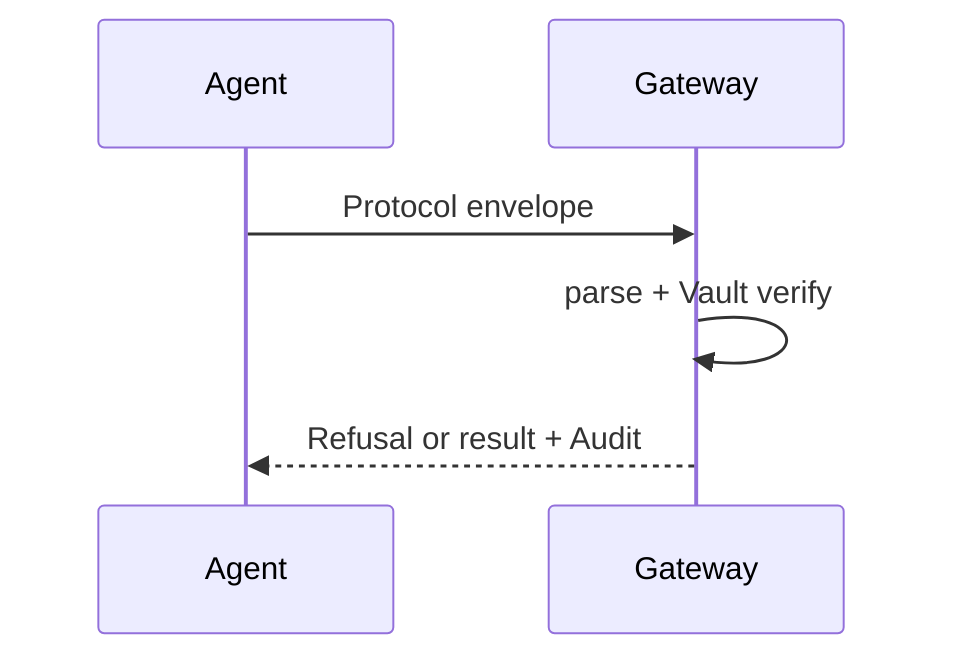

# Mermaid Diagrams

Use for clear, version-controllable diagrams in Markdown.

## Common Diagrams for this project
- Sequence: Agent → Gateway (Firewall) → Vault → Money action → Audit
- Flowchart: Parse → Verify Mandate → IDPI sanitize → Guardrails → Allow/Refuse
- State: Mandate states (active, expired, revoked, denied)
- ER: agents / mandates / denylist / audit_events tables
- Git graph for release / phase branches

## Syntax Tips
- Use `sequenceDiagram`, `flowchart TD/LR`, `stateDiagram-v2`, `erDiagram`
- Keep labels short and use project vocabulary (Mandate, IDPI, Refusal, Audit)
- Direction: TD for most architecture, LR for narrow flows
- Subgraphs for bounded contexts (Parser, Vault, Firewall, Guardrails)

## Example

## Workflow
1. Draft diagram in the relevant .md (ARCHITECTURE, ADR, design)
2. Render locally (VS Code, Mermaid live editor, or docs site)
3. Update when seams or phases change
4. Keep diagrams honest to implemented code (no speculative boxes)

See `writing-for-agents`, `architecture-review`.
