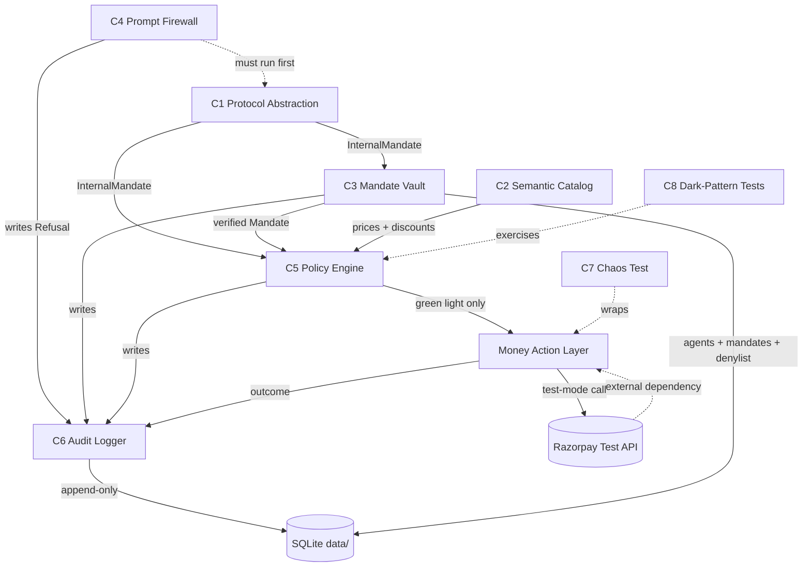
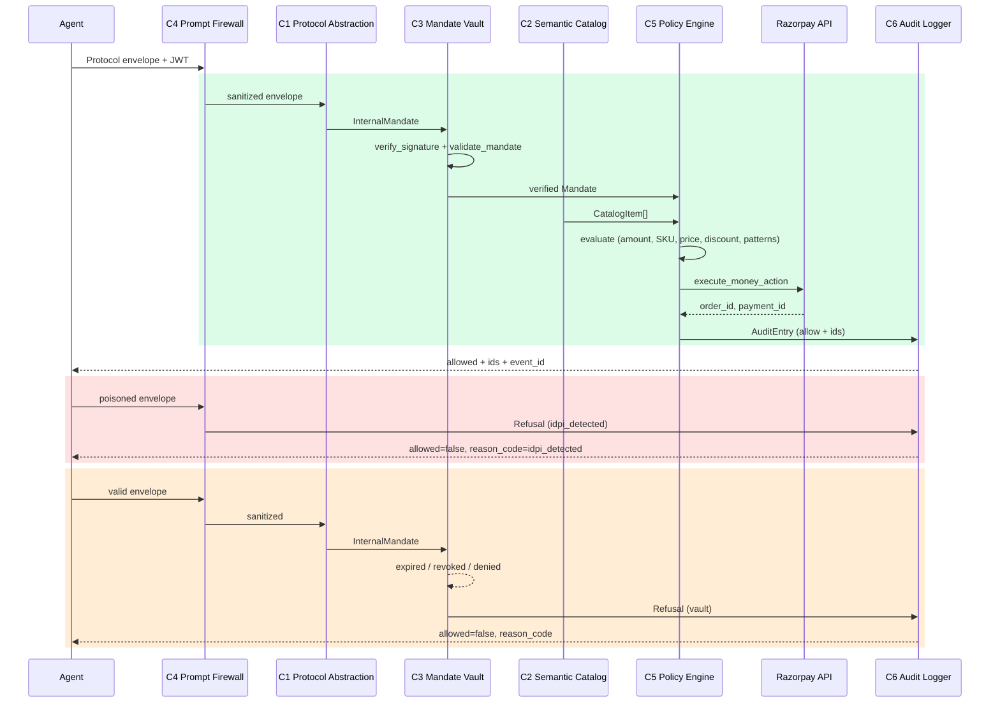
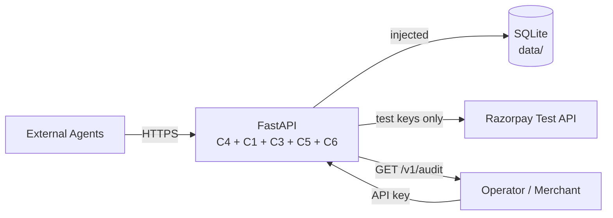

# ACIT Gateway — Architecture

## 1. Overview

The ACIT Gateway is the inbound test-mode bridge for agentic commerce. An external AI Agent presents a Protocol envelope (AP2, TAP, P3P, or UAP). The Gateway verifies the Agent's identity and Mandate bounds, sanitizes IDPI and tool poisoning, enforces Merchant Guardrails, executes a Razorpay test-mode Money action or issues a Refusal, and records every outcome in a tamper-proof SHA-256 hash-chained Audit trail.

Core guarantees:
- Bounded: every action is constrained by a signed Mandate (max amount, SKU allow-list, TTL).
- Gated: C4 (Firewall), C1 (Parser), C3 (Vault), and C5 (Policy) must all pass before any Money action.
- Explainable: every allow and every Refusal produces an append-only AuditEntry with a verifiable hash chain.

Strict constraints: deterministic code only. No LLM participates in Firewall, Vault, Guardrails, Mandate verification, Money actions, or audit hashing (see ADR-0002). All work uses test-mode Razorpay keys only.

## 2. High-Level Architecture

```mermaid
flowchart TD
    subgraph External["External - Untrusted"]
        Agent[Inbound AI Agent<br/>Protocol Envelope + JWT]
    end

    subgraph Gateway["ACIT Gateway"]
        C4[C4: Prompt Firewall<br/>IDPI Sanitizer]
        C1[C1: Protocol Abstraction<br/>Parser]
        C3[C3: Mandate Vault<br/>Signature + State]
        C2[C2: Semantic Catalog]
        C5[C5: Policy Engine<br/>Guardrails]
    end

    subgraph Money["Money Execution"]
        RP[Razorpay Test API<br/>Orders / Payments]
    end

    subgraph Observability["Tamper-Proof Observability"]
        C6[C6: Audit Logger<br/>SHA-256 Chain]
        IDPILog[IDPI Attack Log]
        AuditExport[(Audit Log Export<br/>GET /v1/audit)]
    end

    subgraph TestOnly["Test Only"]
        C7[C7: Chaos Test<br/>Fault Injector]
        C8[C8: Dark-Pattern Tests]
    end

    Agent -->|raw envelope| C4
    C4 -->|clean envelope| C1
    C1 -->|InternalMandate| C3
    C3 -->|verified Mandate| C5
    C2 -->|CatalogItem[]| C5
    C5 -->|allowed| RP
    RP -->|order / payment ids| C6
    C4 -->|idpi_detected| C6
    C1 -->|parse error| C6
    C3 -->|vault refuse| C6
    C5 -->|policy refuse| C6
    C6 --> AuditExport
    C4 -.->|attack evidence| IDPILog
    C7 -.->|inject faults only| RP
    C8 -.->|test cases| C5

    classDef untrusted fill:#fee2e2,stroke:#b91c1c,color:#7f1d1d
    classDef trusted fill:#d1fae5,stroke:#065f46
    classDef audit fill:#e0e7ff,stroke:#3730a3
    classDef external fill:#f3f4f6,stroke:#4b5563
    class Agent untrusted
    class C4,C1,C3,C2,C5 trusted
    class C6,AuditExport,IDPILog audit
    class RP external
```

The diagram shows the single request path through the eight components plus the Razorpay integration and the two observability surfaces (full Audit export and IDPI attack evidence). C7 and C8 only affect the test surface.

## 3. Detailed Component Architecture

```mermaid
flowchart LR
    subgraph C1["C1: Protocol Abstraction"]
        direction LR
        PIn[Protocol + Envelope] --> Parse[parse_ap2 / tap / p3p / uap] --> MB[Mandate Builder] --> POut[InternalMandate]
    end

    subgraph C4["C4: Prompt Firewall"]
        direction LR
        FIn[Raw Envelope] --> Sanit[Refuse bidi/zero-width<br/>Deny keys + poison substrings<br/>Recursive walk] --> FOut[Sanitized or idpi_detected]
    end

    subgraph C3["C3: Mandate Vault"]
        direction LR
        VIn[Mandate + JWT] --> Sig[verify_signature<br/>ES256] --> State[validate_mandate<br/>active, not expired,<br/>not revoked, not denied] --> Store[(SQLite<br/>agents / mandates / denylist)] --> VOut[Verified Mandate or VaultError]
    end

    subgraph C2["C2: Semantic Catalog"]
        direction LR
        CatIn[SKU query] --> Lookup[price + percent bounds] --> CatOut[CatalogItem[]]
    end

    subgraph C5["C5: Policy Engine"]
        direction LR
        PolIn[Verified Mandate + Proposal + Catalog] --> Rules[amount ≤ max<br/>SKU allowlist + catalog<br/>price match<br/>discount ≤ bounds<br/>no dark patterns] --> PolOut[PolicyResult]
    end

    subgraph C6["C6: Audit Logger"]
        direction LR
        AIn[gate + reason + payload] --> Prev[load prev_hash] --> Hash[sha256(prev + payload)] --> Append[(SQLite append-only)] --> AOut[AuditEntry + chain_ok]
    end

    subgraph C7C8["C7 / C8 — Test Only"]
        C7[Chaos: timeout / 5xx / corrupt] -.->|Razorpay adapter only| RPExec
        C8[Dark pattern assertions] -.->|exercises rules| C5
    end
```

Each component is a narrow, deterministic service. Inputs and outputs at the public seam are Pydantic models. Private implementation details (SQLite queries, exact regex) are not part of the architecture surface.

## 4. Component Dependencies



Rules visible in the graph:
- C4 has no dependency on C1 (raw sanitisation precedes parsing).
- C5 is the only component that may call the Money action layer.
- C6 is a sink: every gate and the execution layer write to it.
- C7 is deliberately isolated to the execution seam.

## 5. Data Flow



Every terminal state (allow or Refusal) produces a C6 AuditEntry. The hash chain is computed and persisted before the response is returned to the Agent.

## 6. Security Boundaries

```mermaid
flowchart LR
    subgraph Untrusted["UNTRUSTED — External Agents"]
        Ext[AI Agent<br/>any Protocol envelope]
    end

    subgraph Boundary["SANITISATION BOUNDARY — C4 Prompt Firewall"]
        FW[C4: deterministic IDPI scan<br/>bidi + zero-width refuse<br/>key denylist + substring poison<br/>recursive]
    end

    subgraph Trusted["TRUSTED — Internal Components"]
        direction LR
        C1[C1 Parser] --> C3[C3 Vault<br/>ES256 + state checks]
        C3 --> C5[C5 Policy Engine<br/>deterministic rules only]
        C2[C2 Catalog] --> C5
    end

    subgraph TamperProof["TAMPER-PROOF — C6 Audit"]
        C6[C6 Audit Logger<br/>append-only<br/>hash = sha256(prev || payload)]
    end

    Ext -->|raw envelope| FW
    FW -->|clean envelope| C1
    FW -->|idpi Refusal| C6
    C5 -->|allow or refuse| C6
    C3 -->|refuse| C6

    classDef untrusted fill:#fee2e2,stroke:#b91c1c
    classDef boundary fill:#fef3c7,stroke:#92400e
    classDef trusted fill:#d1fae5,stroke:#065f46
    classDef tamper fill:#e0e7ff,stroke:#3730a3
    class Ext untrusted
    class FW boundary
    class C1,C3,C5,C2 trusted
    class C6 tamper
```

The Firewall (C4) is the only place raw, untrusted content is inspected. After C4 everything inside the process is treated as trusted. The Audit store is append-only; no component may rewrite history (C7 is explicitly prohibited from touching C6).

## 7. Data Models

**InternalMandate** (alias Mandate)  
The single canonical representation of a bounded spend authority. Contains: stable mandate_id, agent_id, optional user_id, protocol, max_amount_paise, currency, sku_allowlist (non-empty), expires_at (UTC), and optional items.

**Proposal**  
A concrete purchase attempt the Agent wishes to execute inside an existing Mandate. Contains: mandate_id, merchant_id (Catalog lookup key; not a DB column), list of OrderItem (sku, quantity, unit_amount_paise), quoted_total_paise, quoted_discount_paise, and copy (strings the Agent shows the user that are scanned for dark patterns).

**PolicyResult**  
The outcome of C5 evaluation: mandate_id, allowed (boolean), optional reason_code, and list of violations. `allowed=true` is the only value that permits a Money action.

**AuditEntry**  
An immutable record written by C6: event_id, gate, reason_code, payload_json, prev_hash (64 hex or genesis zeros), hash (sha256 of prev + payload), created_at (UTC).

**CatalogItem**  
Merchant source-of-truth offer: sku, name, description, unit_amount_paise, inventory, discount_bounds (`min_percent`/`max_percent`), categories. Prices and discounts in the Proposal are compared against Catalog unit amounts and percent bounds — not a paise floor such as `min_discount_paise`.

All monetary values are non-negative integers in paise. All timestamps are timezone-aware UTC. Models are Pydantic v2.

## 8. Component Details

| Component | Purpose | Input | Output | Dependencies |
|-----------|---------|-------|--------|--------------|
| C1: Protocol Abstraction | Parse AP2/TAP/P3P/UAP → InternalMandate | Protocol payload (dict + protocol) | InternalMandate | None (structure only) |
| C2: Semantic Catalog | Machine-readable merchant inventory | GET /catalog or SKU list | JSON list of CatalogItem | None (or SQLite fixtures) |
| C3: Mandate Vault | Verify signatures, store mandates | Mandate + signature/JWT, agent registration data | ValidationResult (allowed or reason_code) | C1 (Mandate model), SQLite, crypto utils |
| C4: Prompt Firewall | Sanitise inbound payloads for IDPI/tool poison | Raw Protocol payload | Sanitised payload or Refusal (idpi_detected) | Writes to C6 only |
| C5: Policy Engine | Deterministic rule execution + Guardrails | Proposal + verified Mandate + Catalog | PolicyResult | C3 (validated Mandate), C2 (Catalog) |
| C6: Audit Logger | Append-only SHA-256 audit | Any gate Action + payload | AuditEntry (with prev_hash + hash) | SQLite; called by C1–C5 + execution |
| C7: Chaos Test | Inject failures, test recovery | Test config (fault type) | Test results + graceful Refusal + Audit | Execution layer after C5 (Razorpay adapter only) |
| C8: Dark-Pattern Tests | Test for false urgency, invented discounts, confirm-shaming | N/A (test suite) | Pass/Fail assertions | C5 (Policy Engine) |

Note: The Razorpay test-mode adapter is invoked only after C5 returns allowed=true and always results in a C6 record.

## 9. Security Considerations

**IDPI Prevention**  
C4 runs deterministic sanitisation on the raw envelope before any parsing. It rejects suspicious keys, refuses bidi and zero-width characters (soft hyphen U+00AD is normalised rather than refused), and matches a substring denylist. No LLM is used (ADR-0002).

**Mandate Validation**  
C3 performs cryptographic verification (ES256 JWT, kid must equal sub) and state checks (active, not expired, not revoked, not denylisted). The parser may emit an expired Mandate; the Vault refuses it.

**Audit Trail**  
C6 appends only. Each row stores `hash = sha256(prev_hash || payload_json)`. Genesis row uses 64 zero characters. The chain is verified on demand via GET /v1/audit. No UPDATE or DELETE is ever performed (ADR-0003).

**No LLM on Money Path**  
Firewall, Vault, Guardrails, Mandate verification, Razorpay calls, and hashing are pure deterministic code. An LLM may act as a client (the Agent) but never inside the gates.

**OWASP Top 10 for Agentic Applications**  
- ASI01 (Agent Identity): C3 ES256 + registration/denylist  
- ASI02 (Indirect Prompt Injection): C4 deterministic Firewall  
- ASI03 (Over-privileged / Mandate bypass): C3 state + C5 bound checks  
- ASI05 (Supply-chain / Catalog integrity): C2 as single source of price truth  
- ASI06 (Insufficient Logging): C6 hash-chained append-only Audit on every path

Refusal with a coded reason_code is a successful, auditable outcome, not an error.

## 10. Deployment Architecture

Single FastAPI process. SQLite file under `data/`. All dependencies (db_path, Razorpay client) are injected at the edges.



Docker (Dockerfile + docker-compose.yml) packages the service. Environment supplies only test-mode Razorpay keys. Health endpoint and catalog are unauthenticated for discovery; spend and audit paths require appropriate credentials.

## 11. References

- `CONTEXT.md` — ubiquitous language
- `design.md` — detailed contracts, policy rules, models
- `ARCHITECTURE.md` (older numbering) — historical view
- `PHASES.md` — build order and C1–C8 responsibilities
- `AGENTS.md` + `RULES.md` — coding and process constraints
- `adr/0001-canonical-mandate.md`
- `adr/0002-no-llm-on-money-path.md`
- `adr/0003-sqlite-hash-chain-audit.md`
- `PRD.md` — problem statement and acceptance criteria
