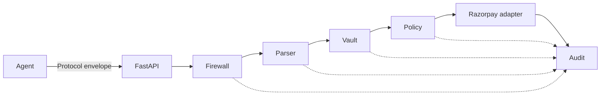

# Architecture

Single FastAPI process. SQLite under `data/`. Inbound Protocol envelopes become one Mandate; Money actions go to Razorpay test-mode through one adapter.

## Request path

```
Protocol envelope
    → Firewall          (IDPI / tool-poison sanitizer)
    → Parser            (envelope → Mandate)
    → Vault             (Agent identity)
    → Policy            (Guardrails + Catalog)
    → Razorpay adapter  (test-mode Money action)
    → Audit             (hash-chained event)
```

A failure at any gate is a Refusal and still writes an Audit event. The Razorpay adapter is never called unless every gate passed.



## Modules

| Package | Seam | Holds |
|---|---|---|
| `src/api/routes` | HTTP | Catalog read, envelope submit, audit read, health |
| `src/api/middleware` | HTTP | Request id, timing |
| `src/models` | Types | Mandate, Agent, Catalog, Audit event |
| `src/services/firewall` | Envelope in, clean envelope or Refusal | IDPI patterns, MCP tool-poison strings |
| `src/services/protocol_parser` | Envelope in, Mandate or Refusal | AP2 / P3P / TAP / UAP adapters |
| `src/services/vault` | Mandate in, verified Agent or Refusal | JWT / key verify |
| `src/services/policy` | Mandate + Catalog in, allow or Refusal | Guardrails |
| `src/services/catalog` | Query in, offers out | What the Merchant sells |
| `src/services/audit` | Event in, chained row out | SHA-256 hash chain |
| `src/services/chaos` | Test-only | Faults at the Razorpay adapter seam |

Keep service interfaces small. Callers (routes and tests) share the same seam. Do not construct the Razorpay client or SQLite connection inside policy/firewall/parser.

## Persistence

SQLite file in `data/`. Catalog, Vault material, and Audit events are tables. Audit rows are append-only: `hash = sha256(prev_hash || payload)`. Never update or delete Audit events.

## Chaos

Fault injection lives only at the Razorpay adapter seam, behind a test/config flag. Do not randomise Firewall or Vault in production-shaped runs.

## Where not to add packages

- No `src/llm/` and no model client on the Money path (ADR-0002).
- No second payment engine per protocol (ADR-0001).
- No Postgres, queue, or extra process for MVP (ADR-0003).
