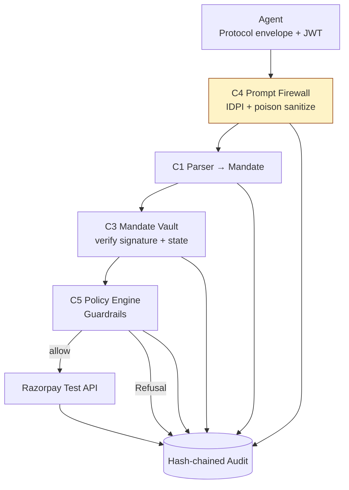

# ACIT Gateway

**Deterministic test-mode bridge for agentic payments — cryptographic Mandates, IDPI defense, hash-chained Audit.**

> Test mode only. No live money. No LLM on the critical path.

## What it is

The ACIT Gateway is the inbound test-mode bridge for agentic commerce. An external AI Agent presents a Protocol envelope (AP2, TAP, P3P, or UAP). The Gateway verifies the Agent's identity and Mandate bounds, sanitizes IDPI and tool poisoning, enforces Merchant Guardrails, executes a Razorpay test-mode Money action or issues a Refusal, and records every outcome in a tamper-proof SHA-256 hash-chained Audit trail.

Core guarantees:
- **Bounded**: every action is constrained by a signed Mandate (max amount, SKU allow-list, TTL).
- **Gated**: Firewall (C4), Parser (C1), Vault (C3), and Policy (C5) must all pass before any Money action.
- **Explainable**: every allow and every Refusal produces an append-only AuditEntry with a verifiable hash chain.

Strict constraints: deterministic code only. No LLM participates in Firewall, Vault, Guardrails, Mandate verification, Money actions, or audit hashing (see ADR-0002). All work uses test-mode Razorpay keys only.

Language and definitions: [CONTEXT.md](CONTEXT.md)
Full architecture and diagrams: [ARCHITECTURE.md](ARCHITECTURE.md)
Specification: [SPEC.md](SPEC.md)
Decisions: [DECISIONS.md](DECISIONS.md) (expanded ADRs)
Historical decisions: [adr/](adr/)

### High-Level Flow



See the complete diagrams, component details, and security boundaries in [docs/ARCHITECTURE.md](docs/ARCHITECTURE.md).

## Key Features

- Cryptographic Mandate bounds (amount, SKU allow-list, TTL) verified in the Vault
- Deterministic IDPI and tool-poison sanitization in the Prompt Firewall (C4) — no LLM
- Merchant Guardrails enforced by the Policy Engine before any Money action
- Every outcome (allow or Refusal) writes a verifiable SHA-256 hash-chained Audit event
- Razorpay test-mode adapter only (chaos injection applies exclusively here)
- Defense-only design (Track 02). No offense-capable tooling.

## Buildathon Tracks Alignment

| Track | Focus                        | Role in This Project                              |
|-------|------------------------------|---------------------------------------------------|
| 01    | Agentic commerce (primary)   | Full Mandate → bounded test-mode payment flow     |
| 02    | Defense-only IDPI (secondary)| Prompt Firewall + deterministic input sanitization|
| 05    | Infra (tertiary)             | Audit chain, Docker, packaging, hooks, .grokignore|

See [AGENTS.md](AGENTS.md) and [PHASES.md](PHASES.md) for Prompt-8 numbering and constraints.

## Tech Stack

- Python ≥ 3.11
- FastAPI + Uvicorn
- Pydantic v2 + pydantic-settings
- SQLAlchemy (SQLite)
- Razorpay SDK (test mode only)
- PyJWT + cryptography (ES256 Mandate signatures)
- pytest, ruff, mypy, coverage
- Docker + docker compose

Full dependencies and configuration: [pyproject.toml](pyproject.toml)

## Quick Start

### Docker (recommended)

```bash
git clone <this-repo>
cd acit-gateway

cp .env.example .env
# Edit .env with your rzp_test_* keys only

docker compose up --build
```

The API is available at http://localhost:8000.

### Local development

```bash
python -m venv .venv

# Windows (pwsh)
. .venv\Scripts\Activate.ps1

# macOS / Linux
source .venv/bin/activate

pip install -e ".[dev]"
cp .env.example .env
# Edit .env with test keys

uvicorn src.main:app --reload
```

### Tests

```bash
pytest tests/unit tests/integration tests/chaos -q
```

Current status and phase checklist: [AGENTS.md](AGENTS.md) and [PHASES.md](PHASES.md).

## Security Note (Critical)

- **.grokignore** deliberately excludes:
  - `.env`, `.env.*`, `*.pem`, `*.key`, secrets/
  - `.grok/hooks/`, `.grok/sessions/`, `.grok/traces/`
  - `data/*.db`, `*.sqlite`, logs, build artifacts
  This prevents credentials and agent session data from entering context or indexes.
- **Hooks** (`.grok/hooks/`):
  - `validate-command.sh` + `security.json` block dangerous shell operations (destructive commands, network egress, etc.).
  - Additional hooks support memory hygiene.
- Never commit live Razorpay keys.
- The gateway itself contains **no LLM** on the Firewall, Vault, Guardrails, Mandate verification, Money action, or Audit paths (ADR-0002). All external input is untrusted.

Additional rules: [RULES.md](RULES.md) and [adr/0002-no-llm-on-money-path.md](adr/0002-no-llm-on-money-path.md).

## Project Structure (Brief)

Full layout (what is on disk today): [TREE.md](TREE.md).

- `src/` — FastAPI app; `services/checkout.py` is the money-path hub (`run_execute`)
- `tests/` — unit + integration; fixtures under `tests/fixtures/`
- `docs/` — glossary, spec, ADRs, SOUL, TROUBLESHOOTING; start at [CONTEXT.md](CONTEXT.md)
- `graphify-out/` — generated graph; gitignored

Implementation order: [PHASES.md](PHASES.md).

## Graphify Knowledge Graph

A structural view of the codebase lives in `graphify-out/`. Use it for
architecture queries (god nodes, coupling, communities) instead of
reading every file.

- `graphify-out/GRAPH_REPORT.md` — summary report (god nodes, communities, surprising connections)
- `graphify-out/graph.json` — raw graph data (164 nodes, 219 edges, 36 communities)
- `graphify-out/graph.html` — interactive visualization (open in a browser)

The `graphify-out/cache/` directory is regenerable AST scratch and is
excluded from Cursor's index via `.cursorignore`.

## License

Student Buildathon project — Razorpay AI Buildathon 2026.  
Not an official Razorpay product.

Test-mode keys only. Internal freeze: 4 September 2026.
