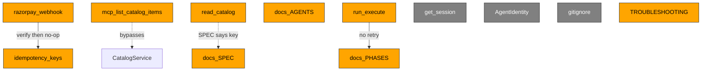

# Repo health report — 2026-09-05

HEAD `319d706` (PR #6, `chore/untrack-ghost-mirrors`) compared to the prior graph baseline 164 nodes / 219 edges / 36 communities. Graph regenerated this run on `src/` + `tests/` only: 426 nodes / 712 edges / 29 communities.

## Summary

P0: 0, P1: 8, P2: 4 (new: 3, known: 9)
Suite is green (104 passed). No P0: test-mode only, HMAC on the webhook is real, audit export is gated, F20 stub is gone. Debt is incomplete webhook apply, stale agent docs, SPEC vs catalog auth, and accepted freeze trade-offs.

## P1 — Major

### H1 — Webhook is verify-only stub (P1)
- Where: `src/main.py:286`
- Status: NEW
- Impact: HMAC-SHA256 passes, then the handler returns `{"status": "success"}` with no mandate or Audit write (shallow module, leaked ordering: verify then no-op).
- Fix: Apply `payment.captured` / `payment.failed` to mandate state and Audit, or return a not-processed status until that exists.
- Ticket: yes — signed event updates mandate + Audit, or the response no longer claims success.

### H2 — In-memory webhook idempotency (P1)
- Where: `src/main.py:64`
- Status: Known
- Impact: `_idempotency_keys` is a process-local set; restart or a second worker forgets keys. Harmless while H1 is a no-op; required before apply lands.
- Fix: Persist keys in the same SQLite file as Vault/Audit (or refuse multi-worker).
- Ticket: yes — duplicate delivery after process restart stays idempotent.

### H3 — MCP catalog hardcoded, skips CatalogService (P1)
- Where: `src/main.py:93`
- Status: NEW
- Impact: `mcp_list_catalog_items` returns two in-file SKUs and never calls `CatalogService` (missing seam). Wrong offers if MCP is enabled.
- Fix: Inject `get_catalog()` and return `CatalogService.get_catalog` items.
- Ticket: yes — MCP catalog matches `GET /v1/catalog` for the same merchant.

### H4 — Stale docs/AGENTS.md body (P1)
- Where: `docs/AGENTS.md:21`
- Status: Known
- Impact: Banner says stale, but the Now section still tells agents `src/` and `tests/` are empty skeleton stubs.
- Fix: Replace the Now section with a pointer to `run_execute` and `docs/MEMORY.md`.
- Ticket: yes — `docs/AGENTS.md` no longer claims empty runtime trees.

### H5 — SPEC claims catalog API key; route has none (P1)
- Where: `src/api/routes/catalog.py:14`
- Status: NEW
- Impact: `docs/SPEC.md` table lists `GET /v1/catalog` as API key; `read_catalog` has no `Depends` auth. Published table vs code. Not the money path.
- Fix: Add the same key check used on Audit export, or drop the API-key claim from the SPEC table.
- Ticket: yes — SPEC auth column and the catalog route agree.

### H6 — No CI workflow (P1)
- Where: `docs/TROUBLESHOOTING.md:249`
- Status: Known
- Impact: No `.github` workflows. Green is local `uv run pytest` only. Deliberate at `5e7719b`.
- Fix: One pytest workflow on `src/` + `tests/` after the freeze.
- Ticket: no — registry marks this deliberate for the submission freeze.

### H7 — CVE-2024-24762 accepted on python-multipart 0.0.6 (P1)
- Where: `docs/TROUBLESHOOTING.md:253`
- Status: Known
- Impact: Pin matches `fastapi-users==12.1.0`. ReDoS/DoS class. Test-mode freeze accepted the trade-off.
- Fix: Bump fastapi-users so python-multipart can move to a patched release.
- Ticket: no — accepted for the freeze; registered as post-hackathon work.

### H8 — Day 7 retry missing (P1)
- Where: `docs/PHASES.md:90`
- Status: Known
- Impact: `run_execute` catches executor/chaos once, writes Refusal + Audit (`executor_failure`). No retry. Graceful path is proven; retry box stays unchecked.
- Fix: One bounded retry around `executor.execute`, then the existing Refusal path.
- Ticket: yes — a single injected fault can succeed on retry, or still refuse with a verified chain.

## P2 — Hygiene

### H9 — Dead get_session (P2)
- Where: `src/api/dependencies.py:68`
- Status: Known
- Impact: Dead interface. FastAPI `get_session` and `src/db/core.py` exist; no route Depends on them. Vault/Audit open their own sqlite3.
- Fix: Delete both wrappers when a caller finally needs AsyncSession, or wire one route through them.
- Ticket: no — unused DI; do not invent a consumer.

### H10 — Dead AgentIdentity (P2)
- Where: `src/models/agent.py:15`
- Status: Known
- Impact: Dead interface. Exported from `src/models/__init__.py`; no route or service constructs it. Vault uses `AgentRow`.
- Fix: Delete the model and export, or use it on agent-register when that route exists.
- Ticket: no — unused model; SPEC `POST /v1/agents` is also absent.

### H11 — Python 3.11 docs vs 3.14 venv (P2)
- Where: `docs/TROUBLESHOOTING.md:250`
- Status: Known
- Impact: Docs and `requires-python` say 3.11+. Local venv is 3.14. Suite still 104 passed.
- Fix: One sentence in README/TROUBLESHOOTING that 3.12–3.14 are used in practice.
- Ticket: no — drift only; tests stay green.

### H12 — Junctions and graphify root leftovers (P2)
- Where: `.gitignore`
- Status: Known
- Impact: `.claude/` and `data/` are gitignored (improved vs 96 reparse points). Graphify writes `graphify-out/` (also ignored). Not a shipped defect.
- Fix: Keep scanning `src/` + `tests/` only; do not stage generated graph files.
- Ticket: no — already ignored; this run did not recurse junctions.

## Graph view

- H1 -> `src_main_razorpay_webhook` (community FastAPI App Entry)
- H2 -> `_idempotency_keys` edge on `src_main_py` (community FastAPI App Entry)
- H3 -> `src_main_mcp_list_catalog_items` missing edge to `CatalogService` (community FastAPI App Entry / Catalog Models)
- H4 -> off-graph doc; contradicts `run_execute` community Checkout Execute
- H5 -> `routes_catalog_read_catalog` (community Catalog Routes) vs SPEC table
- H6 -> registry row; no `.github` on disk
- H7 -> registry pin row
- H8 -> `services_checkout_run_execute` (community Checkout Execute)
- H9 -> `api_dependencies_get_session` (community API Dependencies)
- H10 -> `models_agent_agentidentity` (community Catalog Models)
- H11 -> registry Python-drift row
- H12 -> `.gitignore` + registry junction / graphify rows

God-node degree (`PolicyEngine` 24, `CatalogService` 22, `Mandate`/`Vault` 21) is not a defect. INFERRED test-helper edges match last triage F14–F18 (refuted). F20 audit-export stub is gone: `require_audit_admin` + `verify_chain` + `get_full_chain`.

Graph delta vs cited 164 / 219 / 36: +262 nodes, +493 edges, -7 communities. Structural add: `test_chaos_graceful`, `require_audit_admin`, `get_full_chain`, deeper `run_execute` / checkout test nodes. Communities dropped because package `__init__` isolates clustered thinner (29 vs 36).

## Unproven

- Dependabot open-alert counts are live from `gh api` (1 critical, 12 high, 11 medium, 6 low = 30). No local file:line maps those CVEs to a call site, so they stay out of the main list. Banner fallback 95 = 2 critical / 46 high is stale vs this pull.
- Whether MCP is enabled in any deployed demo (`MCP_ENABLED`) was not checked against a running process.

## Registry cross-check

| Known-Broken row ([docs/TROUBLESHOOTING.md](../TROUBLESHOOTING.md)) | Verdict | Evidence |
|---|---|---|
| Junction farms (`.claude/skills`, `data/skills`) | improved | `.gitignore` ignores `.claude/` and `data/`; this scan used `src/` + `tests/` only |
| Stale `docs/AGENTS.md` | still open | `docs/AGENTS.md:21` still claims empty stubs |
| No CI workflow | still open | no `.github` directory; row still Deliberate |
| Python drift 3.11 vs 3.14 | still open | registry L250; suite 104 passed on this box |
| In-memory `_idempotency_keys` | still open | `src/main.py:64` still a module-level `set` |
| Duplicate rule generations | still open | not re-opened as a ticket; money-path files remain canonical |
| uv / python-multipart pin | still open as accepted CVE | `RESOLVED-BY-PIN`; CVE-2024-24762 accepted on 0.0.6 |
| Graphify root leftovers | improved | this run wrote `graphify-out/` only |
| F20 `/audit/export` stub (prior triage, not a registry row) | improved | `src/api/routes/audit.py` uses `require_audit_admin` + `verify_chain` |
